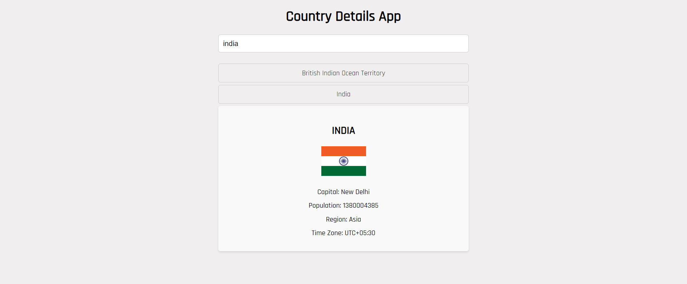

# React Country Detail App

## Table of Contents

- [Links](#links)
- [Description](#description)
- [Screenshot](#screenshot)
- [Demo](#demo)
- [Features](#features)
- [Technologies Used](#technologies-used)
- [Usage](#usage)
- [What I Learned](#what-i-learned)
- [Contributing](#contributing)

## Links

- Solution URL: [GitHub Repository](https://github.com/aruntutter/country-details-app)
- Live Demo: [Live Demo URL](https://animated-bonbon-4b6d03.netlify.app/)

## Description

React Country Detail App is a web application that allows users to search for and view detailed information about countries. Users can enter the country name in the search bar, and the app fetches data from an API to display details such as the country's flag, capital, population, region, and time zone.

## Screenshot

## Demo

Explore the live demo: [Here](https://animated-bonbon-4b6d03.netlify.app/)

## Features

- Search for countries by name.
- View detailed information about the selected country.
- Display country flag, capital, population, region, and time zone.

## Technologies Used

- React
- JavaScript
- HTML
- CSS
- API for country details

## Usage

1. Clone the repository: `git clone https://github.com/aruntutter/country-details-app`
2. Install dependencies: `npm install`
3. Run the development server: `npm start`
4. Open your browser and navigate to [http://localhost:3000](http://localhost:3000)

Now you can interact with the React Country Detail App, search for countries, and view their detailed information.

## What I Learned

While working on this project, I gained insights into:
- Consuming and handling data from a country details API in a React application.
- Implementing search functionality to dynamically fetch and display country details.
- Enhancing the user interface to showcase relevant information clearly.

## Contributing

Contributions to enhance features, fix bugs, or improve the overall project are welcome. Feel free to submit bug reports, suggest new features, or create pull requests. Let's collaborate to make React Country Detail App even better!
